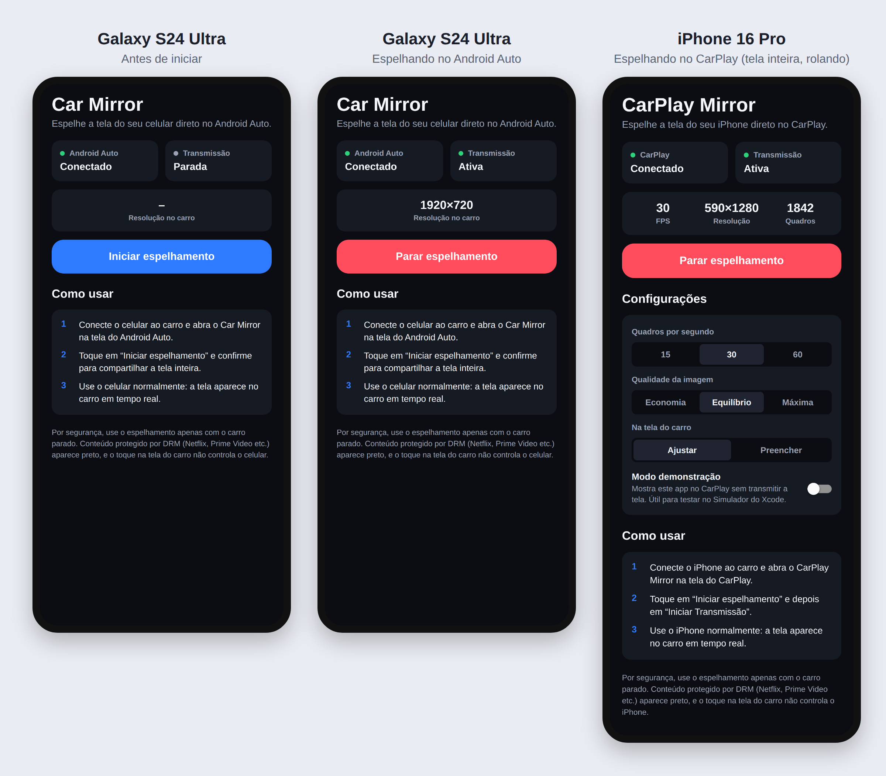

# CarPlay Mirror

App em **React Native** que espelha a tela do celular direto no painel do carro, em tempo real:

- **iPhone → CarPlay** (pensado para o iPhone 16 Pro).
- **Android → Android Auto** (versão B, pensada para o **Galaxy S24 Ultra**). Funciona **sem pagar nada**: veja [Versão Android](#versão-android-android-auto).

Você abre o app na tela do carro, toca em **Iniciar espelhamento** no celular, e o que estiver na tela do celular (qualquer app) aparece no painel.



## Versão Android (Android Auto)

No Android não é preciso conta paga nem aprovação: o Android Auto aceita apps instalados fora da Play Store quando você liga uma opção de desenvolvedor.

**Como funciona:** a tela é capturada com a API oficial de captura de tela do Android (MediaProjection) e espelhada direto na superfície que o Android Auto entrega a apps de navegação. A GPU desenha a imagem na tela do carro, sem compressão, então a qualidade e a fluidez são as da tela do celular.

### Instalar no Galaxy S24 Ultra

1. **Baixe o APK.** No GitHub, abra **Actions** → **Android (.apk)** → a execução mais recente com ✅ → em **Artifacts**, baixe **CarMirror-apk** e extraia o `CarMirror.apk` (dá para fazer tudo pelo navegador do próprio celular).
2. **Instale.** Abra o `CarMirror.apk` no celular. Se o Android pedir, permita **Instalar apps desconhecidos** para o navegador ou o app Arquivos e confirme. Se o Play Protect avisar, toque em **Instalar mesmo assim**.
3. **Libere apps de fora da Play Store no Android Auto** (uma vez só):
   - Abra *Configurações → Dispositivos conectados → Android Auto*.
   - Role até o fim e toque **10 vezes** em **Versão** até aparecer a mensagem de modo de desenvolvedor.
   - No menu **⋮** (canto superior direito), entre em **Configurações do desenvolvedor** e marque **Fontes desconhecidas** (*Unknown sources*).
4. **Mostre o app no carro:** em *Android Auto → Personalizar inicializador*, confira se o **Car Mirror** está marcado.

### Usar

1. Conecte o celular ao carro (cabo ou sem fio) e abra o **Car Mirror** na tela do Android Auto. Ele mostra "Aguardando o celular".
2. No celular, abra o Car Mirror, toque em **Iniciar espelhamento** e confirme. Se o sistema perguntar, escolha compartilhar a **tela inteira**.
3. Use o celular normalmente: a tela aparece no carro. Para parar, toque em **Parar** no carro, em **Parar espelhamento** no app ou em **Parar** na notificação.

Sem carro por perto, dá para testar no computador com o **Desktop Head Unit (DHU)**, o emulador oficial de Android Auto do Android Studio.

### Limitações no Android

- O toque na tela do carro não controla o celular.
- Conteúdo protegido por DRM (Netflix, Prime Video etc.) aparece preto.
- A imagem do celular em pé fica estreita numa tela de carro horizontal; vídeos e apps em paisagem ocupam a tela toda.
- O Android pode encerrar a captura quando a tela do celular bloqueia; é só iniciar de novo.
- Use apenas com o carro parado.

## Antes de começar: o que o iOS permite

O CarPlay não tem espelhamento de tela nativo, e o iOS não deixa um app capturar a tela de outros apps livremente. Este projeto usa o único caminho viável sem jailbreak:

1. **Captura**: uma *Broadcast Upload Extension* do ReplayKit (o mesmo recurso de "Transmitir tela" da Central de Controle) recebe os quadros da tela inteira do iPhone.
2. **Exibição**: o app se registra no CarPlay como **app de navegação**. Só essa categoria recebe uma janela própria (`CPWindow`) onde dá para desenhar livremente, e é nela que a tela do iPhone aparece.

Isso tem consequências que você precisa conhecer:

| Ponto | Detalhe |
| --- | --- |
| **Entitlement da Apple** | Para aparecer no CarPlay de um carro de verdade, o App ID precisa do entitlement **CarPlay Navigation** (`com.apple.developer.carplay-maps`), concedido pela Apple mediante [solicitação](https://developer.apple.com/contact/carplay/). **No Simulador do Xcode funciona sem aprovação.** |
| **App Store** | As diretrizes do CarPlay determinam que a janela de apps de navegação seja usada só para mapas. Um app de espelhamento seria recusado na App Store. O projeto serve para uso pessoal/desenvolvimento. |
| **Toque** | Tocar na tela do carro **não** controla o iPhone (o iOS não permite injetar toques em outros apps). |
| **DRM** | Netflix, Prime Video, Disney+ etc. aparecem pretos: o iOS bloqueia a captura de conteúdo protegido. |
| **Áudio** | O áudio não passa pelo espelhamento; ele segue a rota normal do iOS (no CarPlay, normalmente os alto-falantes do carro). |
| **Segurança** | Use apenas com o carro parado. |

## Como funciona

```
 iPhone (qualquer app)
        │  ReplayKit (quadros da tela inteira)
        ▼
 BroadcastExtension  ── reduz + rotaciona + JPEG (Core Image/GPU)
        │  TCP local (127.0.0.1), com handshake pelo token da instalação
        ▼
 App CarPlayMirror   ── decodifica o quadro mais recente
        │                           ▲
        ▼                           │ status / configurações (TurboModule)
 CPWindow (tela do CarPlay)    Interface React Native no iPhone
```

- A extensão limita o FPS sem perder a última mudança da tela: se um quadro chega antes do intervalo, ele é enviado assim que o intervalo termina.
- Só o quadro mais recente é processado em cada etapa (nada se acumula em fila), o que mantém a latência baixa.
- Se o app for reiniciado, a extensão reconecta sozinha e reenvia o último quadro.
- A conexão é só local e não precisa de App Group, então o app funciona até instalado com Apple ID gratuito. Antes de enviar qualquer imagem, a extensão confere um token derivado da pasta onde o iOS instalou o app; outro app não tem como conhecê-lo e, portanto, não recebe a sua tela.
- No CarPlay, um `CPMapTemplate` mostra os botões **Preencher/Ajustar** e **Parar**, que se escondem sozinhos depois de alguns segundos.

## Estrutura

```
App.tsx                         # Entrada do React Native
specs/NativeScreenMirror.ts     # Especificação do TurboModule (codegen)
src/
  screens/HomeScreen.tsx        # Tela principal (status, iniciar/parar, configurações)
  hooks/useMirrorStatus.ts      # Consulta o status nativo 1x por segundo
  native/screenMirror.ts        # Wrapper do módulo nativo
  native/presets.ts             # Presets de FPS e qualidade
  components/                   # Componentes visuais
ios/
  Config.xcconfig               # ← Bundle ID, Team e entitlement do CarPlay
  Shared/MirrorShared.swift     # Código comum ao app e à extensão (protocolo, configurações)
  BroadcastExtension/           # Extensão ReplayKit (captura + JPEG + envio)
  CarPlayMirror/
    AppDelegate.swift           # Inicializa o React Native e o receptor de quadros
    PhoneSceneDelegate.swift    # Janela do iPhone (React Native)
    CarPlay/                    # Cena do CarPlay e view que desenha a tela espelhada
    Mirror/                     # Receptor (TCP local), decodificação, estado, modo demonstração
    NativeModules/RCTScreenMirror.mm  # TurboModule "ScreenMirror"
android/app/src/main/java/com/carplaymirror/
  mirror/                       # Captura (MediaProjection), serviço e módulo "ScreenMirror"
  auto/                         # Android Auto: CarAppService, sessão e tela (NavigationTemplate)
.github/workflows/ios-ipa.yml   # Compila num Mac do GitHub e gera o .ipa
.github/workflows/android-apk.yml  # Compila o .apk do Android
```

## Instalar no iPhone sem Mac (Windows + Sideloadly)

Você não precisa de Mac: o GitHub compila o app num Mac na nuvem (grátis em repositório público) e você instala o `.ipa` pelo Windows com o seu Apple ID, mesmo gratuito.

1. **Baixe o .ipa.** No GitHub, abra a aba **Actions** → **iOS (.ipa para Sideloadly)** → a execução mais recente com ✅ → em **Artifacts**, baixe **CarPlayMirror-ipa** e extraia o `CarPlayMirror.ipa` do zip.
   - O Bundle ID padrão é `com.<seu-usuario-github>.carplaymirror`. Para usar outro, clique em **Run workflow** e preencha `bundle_id`.
2. **Prepare o Windows.** Instale o **iTunes** e o **iCloud** baixados do site da Apple (as versões da Microsoft Store não servem para o Sideloadly) e depois o **Sideloadly** (<https://sideloadly.io>).
3. **Conecte o iPhone** pelo cabo, desbloqueie e toque em **Confiar** neste computador.
4. **Instale.** Abra o Sideloadly, arraste o `CarPlayMirror.ipa`, escolha o iPhone, digite o seu Apple ID e clique em **Start** (confirme o código de dois fatores se pedir).
5. **Libere o app no iPhone:**
   - *Ajustes → Geral → VPN e Gerenciamento de Dispositivo* → seu Apple ID → **Confiar**.
   - *Ajustes → Privacidade e Segurança → Modo de Desenvolvedor* → ativar (o iPhone reinicia).
6. **Renove a cada 7 dias.** Com Apple ID gratuito o app expira em 7 dias; repita o passo 4 (o Sideloadly também pode renovar sozinho pelo Wi-Fi com o PC ligado).

O Sideloadly é uma ferramenta de terceiros e pede o seu Apple ID para assinar o app; se preferir, use um Apple ID secundário.

**O que funciona assim:** o app abre, a transmissão da tela liga e você vê FPS/resolução no app. **O que não funciona:** o app não aparece no CarPlay, porque o entitlement de CarPlay só vem com a aprovação da Apple numa conta paga (veja a tabela no início).

## Compilar no Mac (Xcode)

### Requisitos

- Mac com **Xcode 16 ou superior** (o iPhone 16 Pro roda iOS 18+).
- **Node.js 22.11+** e **Ruby/Bundler** (para o CocoaPods).
- Apple ID (gratuito basta para instalar no seu iPhone). O entitlement do CarPlay exige conta paga do **Apple Developer Program** e aprovação da Apple.

### Configuração

1. Instale as dependências JavaScript:

   ```sh
   npm install
   ```

2. Edite **`ios/Config.xcconfig`** (é o único lugar onde você precisa mexer):

   ```
   // seu Team ID
   DEVELOPMENT_TEAM = ABCDE12345
   MIRROR_BUNDLE_ID = com.seunome.carplaymirror
   // mude para 1 quando a Apple aprovar o entitlement do CarPlay
   MIRROR_CARPLAY_ENTITLEMENT = 0
   ```

   O bundle da extensão (`<bundle id>.BroadcastExtension`) é derivado automaticamente. Não altere o Bundle ID pela interface do Xcode, senão o app e a extensão ficam dessincronizados.

3. Instale os pods (isso também roda o codegen do TurboModule):

   ```sh
   cd ios
   bundle install
   bundle exec pod install
   cd ..
   ```

4. Abra **`ios/CarPlayMirror.xcworkspace`** no Xcode. Com assinatura automática, o Xcode registra os App IDs do app e da extensão para você.

### Testar no Simulador (CarPlay incluso)

```sh
npm run ios
```

No Simulador, abra **I/O → External Displays → CarPlay**. O ícone do CarPlay Mirror aparece na tela do CarPlay. A transmissão do ReplayKit não funciona no Simulador, então ative **Modo demonstração** no app: o CarPlay passa a mostrar a própria tela do app, o que valida todo o caminho de exibição.

### Rodar no iPhone 16 Pro

1. Conecte o iPhone, selecione-o no Xcode e rode o scheme **CarPlayMirror**. Para usar sem o Metro (no carro), rode em **Release**: *Product → Scheme → Edit Scheme → Run → Build Configuration → Release*, ou:

   ```sh
   npx react-native run-ios --mode Release --device
   ```

2. Com `MIRROR_CARPLAY_ENTITLEMENT = 0`, o app instala e a transmissão funciona, mas ele **não aparece no CarPlay**.
3. Para o carro:
   - Solicite o entitlement **CarPlay Navigation** em <https://developer.apple.com/contact/carplay/>.
   - Depois da aprovação, ative a capability no App ID em *Certificates, Identifiers & Profiles* e gere o perfil de provisionamento de novo.
   - Mude `MIRROR_CARPLAY_ENTITLEMENT = 1` em `ios/Config.xcconfig` e compile de novo.
   - Sem carro por perto, dá para testar com o app **CarPlay Simulator** (em *Additional Tools for Xcode*), que transforma o Mac numa central de CarPlay para o iPhone conectado via USB.

## Usando no carro

1. Conecte o iPhone ao CarPlay e abra o **CarPlay Mirror** na tela do carro. Se o ícone não aparecer, procure em *Ajustes → Geral → CarPlay → (seu carro) → Personalizar*.
2. No iPhone, abra o CarPlay Mirror e toque em **Iniciar espelhamento** → **Iniciar Transmissão**.
3. Use o iPhone normalmente. Para parar, toque em **Parar espelhamento** no iPhone, em **Parar** no CarPlay, ou na barra vermelha de gravação do iOS.

Se o seletor de transmissão não abrir, use a Central de Controle: mantenha pressionado **Gravação de Tela**, escolha **CarPlay Mirror** e toque em **Iniciar Transmissão**.

### Configurações

| Opção | Efeito |
| --- | --- |
| **Quadros por segundo** (15/30/60) | Fluidez × consumo de bateria/temperatura. 30 é um bom equilíbrio. |
| **Qualidade** | Economia (960 px, JPEG 45%), Equilíbrio (1280 px, 60%), Máxima (1920 px, 80%), sempre no lado maior da imagem. |
| **Na tela do carro** | *Ajustar* mostra a tela inteira com bordas pretas; *Preencher* corta as bordas para ocupar a tela toda. |

Dica: a tela do iPhone em pé fica estreita numa tela de carro horizontal. Vídeos e apps que giram para paisagem aproveitam a tela inteira.

## Solução de problemas

| Sintoma | O que verificar |
| --- | --- |
| Aviso "Não foi possível usar a porta 47210" | Outro app está usando a porta local. Feche o CarPlay Mirror pelo seletor de apps e abra de novo, ou reinicie o iPhone. |
| O Sideloadly falha com "App ID not available" | O Bundle ID já existe em outra conta: rode o workflow com outro `bundle_id`. |
| App não aparece no CarPlay | Entitlement aprovado + `MIRROR_CARPLAY_ENTITLEMENT = 1`; no Simulador, confira se o build é para o Simulador. |
| A transmissão inicia e para logo em seguida | A extensão tem limite de ~50 MB de memória: use a qualidade *Economia*. |
| CarPlay mostra "Aguardando o iPhone" | O app precisa estar aberto no CarPlay **e** a transmissão ativa. Ao trocar de app no CarPlay, o iOS pode suspender o CarPlay Mirror; volte para ele. |
| Tela preta num app específico | Conteúdo protegido por DRM não é capturado pelo iOS. |

## Scripts

```sh
npm start          # Metro (modo desenvolvimento)
npm run ios        # compila e abre no Simulador/iPhone
npm run android    # compila e instala no Android conectado
npm test           # testes (Jest)
npm run lint       # ESLint + Prettier
npm run typecheck  # TypeScript
```
